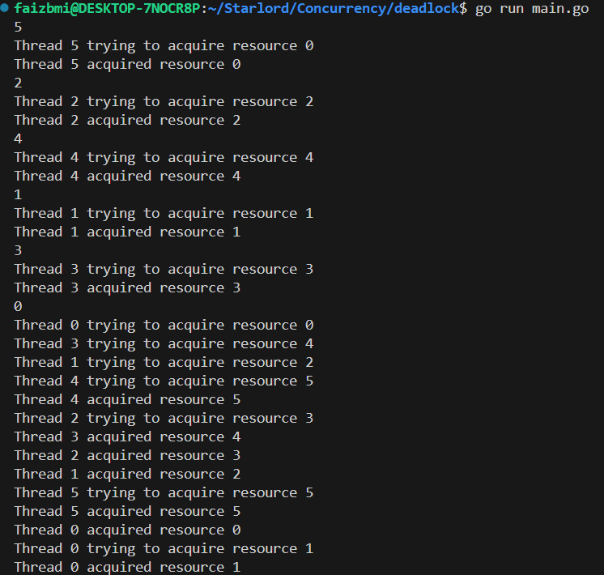

Below screenshot shows deadlock logs

<!-- To fix deadlock, either:
1. kill one thread. That would free a resource acquired by that lock.
2. kill the entire process itself. -->

<!-- Deadlock prevention vs deadlock avoidance -->

<!-- But we want to avoid deadlock. Hence we will impose constraint that threads aqcuire resources in a given order thus eliminating cyclic dependency, hence no deadlock. -->

 Below schreenshot shows how we avoid deadlock by imposing resource allocation in order
